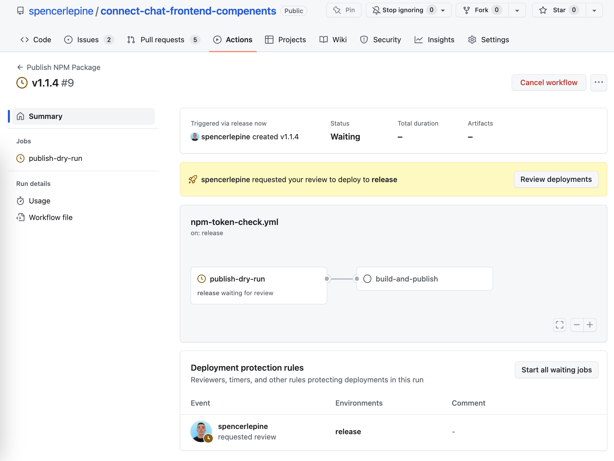

# Npm Package Publish

## [AUTOMATED] GitHub Action Npm Publish Workflow

Steps to configure/update the `npm publish` [workflow](https://github.com/spencerlepine/printify-sdk-js/blob/main/.github/workflows/npm-publish.yml) for automated `npm publish`.

### Setup ⚙️

> Note: must have NPM_TOKEN set in GitHub Secrets, with `automation` permissions

By creating a GitHub deployment environment, you can set environment variables and specify users to approve.

<kbd>

</kbd>

- [npmjs.org] Become admin of the npm package
- [npmjs.org] Create a granular NPM_TOKEN to publish `amazon-connect-chatjs` [[docs](https://docs.npmjs.com/creating-and-viewing-access-tokens)]
- [github.com] Become admin of the GitHub repository
- [github.com] Create/update `release` environment, with required reviewers in repository settings
  [[docs](https://docs.github.com/en/actions/deployment/targeting-different-environments/using-environments-for-deployment)]
- [github.com] Add `NPM_TOKEN` under the secrets for the `release` environment.
- [github.com] Add/remove admin users to the environment (eg. /settings/environments/873739246/edit)

### Usage

Creating a release and triggering the `npm publish` [workflow](https://github.com/spencerlepine/printify-sdk-js/blob/main/.github/workflows/npm-publish.yml).

1. Create a GitHub release: <https://docs.github.com/en/repositories/releasing-projects-on-github/managing-releases-in-a-repository>

   - Head to <https://github.com/spencerlepine/printify-sdk-js/releases>
   - Draft new release
   - Choose tag, enter new semver
   - Click, "create tag on publish"
   - Edit the title/description
   - Publish the release

     <kbd>
       
     </kbd>

2. Workflow is triggered on release (or you can trigger with manual `workflow_dispatch`):

   - Head to <https://github.com/spencerlepine/printify-sdk-js/actions>
   - Expand the pending Npm Publish workflow

     <kbd>
       
     </kbd>

   - Review the workflow

     <kdb>
       
     </kbd>

3. Run the dry-run workflow:

   - Approve the workflow

     <kbd>
       
     </kdb>

   - View Dry-run workflow results

     <kdb>
       
     </kbd>

4. Run the publish workflow:

   - Approve the publish workflow

     <kdb>
       
     </kbd>

     <kdb>
       
     </kbd>

   - View publish workflow results

     <kdb>
       
     </kbd>

5. View the live updated npm package

   <kbd>
   
   </kbd>

   <kbd>
   
   </kbd>

## [MANUAL] Publish with npm cli commands

> Documentation for publishing to npmjs.org: <https://docs.npmjs.com/creating-and-publishing-scoped-public-packages>

1. Create a GitHub release: <https://docs.github.com/en/repositories/releasing-projects-on-github/managing-releases-in-a-repository>

- Head to <https://github.com/spencerlepine/printify-sdk-js/releases>
- Draft new release
- Choose tag, enter new semver
- Click, "create tag on publish"
- Publish the release

2. Publish the package to npm

```sh
git clone https://github.com/spencerlepine/printify-sdk-js.git
cd printify-sdk-js
yarn
yarn build
git status

npm login
npm publish --dry-run
npm publish --access=public
```

3. View release: <https://www.npmjs.com/package/printify-sdk-js>
